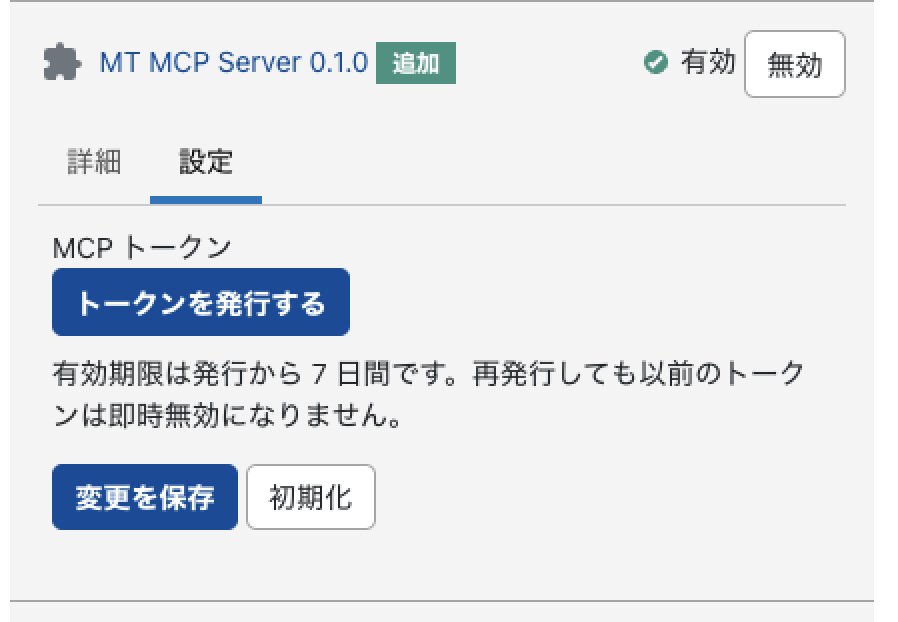

# mt-mcp

Movable Type 9 用の MCP (Model Context Protocol) サーバープラグイン。  
Cursor・Claude Desktop などの MCP クライアントから MT を自然言語で直接操作できます。

## 対応ツール

### ブログ・記事

| ツール名 | 説明 |
|---|---|
| `blog_list` | ブログ（サイト）一覧取得 |
| `entry_list` | 記事一覧取得（`keyword` 部分一致検索・`offset` ページネーション対応） |
| `entry_get` | 記事1件取得（本文含む） |
| `entry_create` | 記事作成（デフォルト: 下書き） |
| `entry_update` | 記事更新 |
| `entry_delete` | 記事削除 |
| `category_list` | カテゴリ一覧取得 |
| `tag_list` | タグ一覧取得 |

### アセット・テンプレート

| ツール名 | 説明 |
|---|---|
| `asset_list` | アセット一覧取得（`keyword` 部分一致検索・`offset` ページネーション対応） |
| `asset_get` | アセット1件取得 |
| `asset_upload` | ファイルアップロード（Base64）による新規アセット作成 |
| `asset_delete` | アセット削除 |
| `asset_thumbnail` | 画像アセットのサムネイルURL取得（MTの動的リサイズ機能を利用） |
| `template_list` | テンプレート一覧取得（`keyword` 部分一致検索・`offset` ページネーション対応） |
| `template_get` | テンプレート1件取得（本文含む） |
| `template_create` | テンプレート新規作成 |
| `template_update` | テンプレート本文更新 |
| `template_delete` | テンプレート削除 |

### コンテンツタイプ・コンテンツデータ（MT7以降）

| ツール名 | 説明 |
|---|---|
| `content_type_list` | コンテンツタイプ一覧取得 |
| `content_type_get` | コンテンツタイプ詳細取得（フィールド定義含む） |
| `content_type_create` | コンテンツタイプ新規作成 |
| `content_data_list` | コンテンツデータ一覧取得（`keyword` 部分一致検索・`offset` ページネーション対応） |
| `content_data_get` | コンテンツデータ1件取得（フィールド値・ラベル含む） |
| `content_data_create` | コンテンツデータ作成 |
| `content_data_update` | コンテンツデータ更新（部分更新対応） |
| `content_data_delete` | コンテンツデータ削除 |

> 削除系ツール（`entry_delete` / `asset_delete` / `template_delete` / `content_data_delete`）は取り消せない操作です。AI が実行する前に対象を一覧・取得系ツールで確認するよう促してください。

### AI の操作フロー

`blog_id` が必要なツールを呼ぶ前に、AI は自動で `blog_list` を使ってブログIDを確認します。  
コンテンツデータ操作では `content_type_get` でフィールドIDを確認してから作成・更新を行います。

```
ユーザー: 「テスト記事を追加して」
AI:       blog_list → blog_id を確認
          → entry_create(blog_id, title="テスト記事", status="draft")

ユーザー: 「コンテンツタイプ〇〇にデータを追加して」
AI:       content_type_list → content_type_id を確認
          → content_type_get → フィールドID・型を確認
          → content_data_create(content_type_id, blog_id, fields={...})
```

## 動作環境

- Movable Type 9（コンテンツタイプ機能は MT7 以降）
- Apache 2.4+ (CGI または mod_perl)
- Perl 5.x (`JSON` モジュール)

## セットアップ

### 1. プラグインをインストール

```bash
cp -r plugins/MTMCP /path/to/mt/plugins/
```

MT を再起動（または `touch mt.cgi`）してプラグインを有効化します。

### 2. Apache の設定

`Authorization` ヘッダーを CGI に渡すために以下いずれかが必要です。**トークンの取得方法（OAuth / ログインAPI / 管理画面）に関わらず、ツール呼び出し本体（`/v4/mcp`）に `Authorization: Bearer <token>` を渡すために必須**です。OAuthを使う場合でも省略できません。

**設定パターン1: VirtualHost / Directory ブロックに追記**
```apache
<Directory "/var/www/html/mt">
    CGIPassAuth On
</Directory>
```

**設定パターン2: `.htaccess` に追記**（サーバ設定を変更できない場合）
```apache
RewriteEngine On
RewriteRule .* - [E=HTTP_AUTHORIZATION:%{HTTP:Authorization}]
```

> どちらも設定できない場合は、`Authorization` の代わりに `X-MT-Authorization: MTAuth accessToken=<token>` ヘッダーを使う方法もあります（後述「認証ヘッダー」参照）。カスタムヘッダーは Apache の追加設定なしでそのまま CGI に渡ります。

### 3. アクセストークンを発行

トークンの発行方法は3通りあります。いずれで発行しても、そのトークンは**発行したユーザー本人**に紐づき、以後の操作（記事作成の著者、ブログへのアクセス権限など）はそのユーザーとして扱われます。

#### 方法A: ブラウザログイン（OAuth 2.1 / PKCE、推奨）

MCP クライアント自体にパスワードを一切渡さない方式です。ブラウザで MT の本物のログイン画面（多要素認証や外部認証を設定していればそれも含めて）にログインし、その場で許可した MCP クライアントだけがアクセストークンを受け取れます。

1. ブラウザで下記 URL を開く（`code_verifier` はクライアント側でランダムに生成し、`code_challenge = BASE64URL(SHA256(code_verifier))`）:
   ```text
   https://example.com/mt/mt.cgi?__mode=mcp_authorize
     &response_type=code
     &client_id=my-mcp-client
     &redirect_uri=http://127.0.0.1:PORT/callback
     &state=<ランダム文字列>
     &code_challenge=<code_verifier のSHA256をBase64URLエンコード>
     &code_challenge_method=S256
   ```
2. MT に未ログインなら通常のログイン画面が表示される。ログイン後、認可確認画面で **許可する** を選択
3. `redirect_uri` に `code`（認可コード）と `state` が付与されてリダイレクトされる
4. **クライアント側は、受け取った `state` が手順1で生成したものと完全に一致することを必ず確認してから次に進んでください。** 一致しない場合はリクエストを中断すること（認可レスポンスの差し替え対策）。
5. 受け取った `code` と、最初に生成した `code_verifier` を使ってトークンと交換する:
   ```bash
   curl -X POST https://example.com/mt/mt-data-api.cgi/v4/mcp/token \
     -H 'Content-Type: application/x-www-form-urlencoded' \
     -d 'grant_type=authorization_code&code=<受け取ったcode>&redirect_uri=http://127.0.0.1:PORT/callback&code_verifier=<code_verifier>'
   ```

成功レスポンス:
```json
{"access_token":"...","refresh_token":"...","token_type":"Bearer","expires_in":604800,"user_id":3,"username":"your-username"}
```

`access_token` の有効期限は7日間です。期限が切れる前（または切れた後）に、ブラウザでの再ログインなしで `refresh_token` を使って新しいアクセストークンを取得できます（対応しているMCPクライアントであれば自動的に行われます）。

```bash
curl -X POST https://example.com/mt/mt-data-api.cgi/v4/mcp/token \
  -H 'Content-Type: application/x-www-form-urlencoded' \
  -d 'grant_type=refresh_token&refresh_token=<refresh_token>'
```

> `refresh_token` の有効期限は30日間です。使用するたびに新しい `access_token` と `refresh_token` が発行され、古い `refresh_token` は即座に無効化されます（ローテーション。盗まれたトークンの使い回しを検知・遮断しやすくするためです）。そのため、応答に含まれる新しい `refresh_token` を必ず保存し直してください。30日間まったく使われなかった `refresh_token` は失効し、その場合は認可フロー（手順1〜5）を最初からやり直す必要があります。

> `redirect_uri` は RFC 8252（ネイティブアプリ向け OAuth）の慣例に従い、次のいずれかのみ許可しています。①ループバック: `http://127.0.0.1:*` / `http://localhost:*` / `http://[::1]:*`（任意のポート）。②プライベートスキーム: `cursor://...` や `claude://...` など http/https 以外のカスタムURLスキーム（Cursor・Claude Desktop などデスクトップアプリが使用）。③既知クライアントの固定HTTPSコールバック（完全一致のみ・現状 Cursor の Background Agent 用 `https://www.cursor.com/agents/mcp/oauth/callback` のみ登録）。任意の外部Webホストへのリダイレクトはオープンリダイレクト対策のため拒否されます。認可コードの有効期限は10分・一度使うと失効します。PKCE は `S256` のみ対応（`plain` は不可）。`POST /v4/mcp/register`（Dynamic Client Registration）で登録済みの `client_id` を使う場合は、認可時の `redirect_uri` がその登録内容と完全一致することも追加で要求されます。
>
> Cursor / Claude Desktop など、MCP のリモートサーバー向け OAuth 自動検出（`WWW-Authenticate: Bearer resource_metadata=...` からの `.well-known` 参照）に対応したクライアントであれば、下記の静的ファイルを配置することでフローの一部を自動化できます。未対応のクライアントでは、上記の手順を独自のログインヘルパー（ブラウザを開いて `redirect_uri` でコードを受け取る小さなスクリプトなど）で実行してください。
>
> `https://example.com/.well-known/oauth-protected-resource`
> ```json
> {
>   "resource": "https://example.com/mt/mt-data-api.cgi/v4/mcp",
>   "authorization_servers": ["https://example.com"]
> }
> ```
> `https://example.com/.well-known/oauth-authorization-server`
> ```json
> {
>   "issuer": "https://example.com",
>   "authorization_endpoint": "https://example.com/mt/mt.cgi?__mode=mcp_authorize",
>   "token_endpoint": "https://example.com/mt/mt-data-api.cgi/v4/mcp/token",
>   "registration_endpoint": "https://example.com/mt/mt-data-api.cgi/v4/mcp/register",
>   "response_types_supported": ["code"],
>   "grant_types_supported": ["authorization_code", "refresh_token"],
>   "code_challenge_methods_supported": ["S256"],
>   "token_endpoint_auth_methods_supported": ["none"]
> }
> ```
> これらは静的ファイルとして Web サーバーのドキュメントルート直下（`/.well-known/`）に配置してください（MT のバージョン管理下の `/mt-data-api.cgi/v4/...` の外側にある必要があります）。`registration_endpoint`（`POST /v4/mcp/register`）は RFC 7591 の Dynamic Client Registration に対応しており、Cursor など事前登録なしで OAuth を試みるクライアントが自動的にクライアントIDを取得できます（client_secret は発行しません＝PKCEを使うパブリッククライアント向け）。

#### IPアドレス制限があるMT環境での注意

Cursor の「Background Agent」のようにクラウド側で動作するMCPクライアントを使う場合、OAuthの一部リクエスト（`.well-known` の取得、`POST /v4/mcp/register`、`POST /v4/mcp/token`）は**ユーザー本人のブラウザではなく、クライアント（Cursorなど）のサーバー自身から**送信されます。MT サーバーに IP アドレス制限（ファイアウォール・WAF・`Require ip` 等）をかけている場合は、これらのエンドポイントに対してそのクライアントのサーバー送信元IPを許可する必要があります。

- 認可画面（`GET /mt.cgi?__mode=mcp_authorize` とその後の `POST`）は、ユーザー本人のブラウザからのアクセスなので、通常どおり管理者の端末からのみ許可されていれば問題ありません。
- `.well-known/*`、`POST /v4/mcp/register`、`POST /v4/mcp/token` は、クライアントのサーバーからのアクセスを許可する必要があります。許可すべき具体的なIPレンジは各クライアント（Cursor等）の公式ドキュメントを参照してください（変更されることがあるため、本READMEには固定のIPを記載しません）。
- IPレンジの継続的な追従が難しい場合は、`.well-known` を公開せず（前述「方法B」または「方法C」に絞る）、OAuthの自動検出を使わない運用も選択肢です。

#### 方法B: ログインAPIで直接発行（非対話・自動化向け）

ブラウザを開けない CLI・CI などから、ユーザー名・パスワードで直接トークンを取得できます。

```bash
read -s -p 'Password: ' MT_PASSWORD; echo
curl -X POST https://example.com/mt/mt-data-api.cgi/v4/mcp/authenticate \
  -H 'Content-Type: application/json' \
  --data-binary @- <<EOF
{"username":"your-username","password":"$MT_PASSWORD"}
EOF
unset MT_PASSWORD
```

成功レスポンスには `access_token` と合わせて `refresh_token` も含まれます。7日ごとに毎回パスワードを入力し直さずに済むよう、`refresh_token`（30日間有効）を保存しておき、`grant_type=refresh_token` で更新できます（方法A の「OAuth」節にある `POST /v4/mcp/token` の例と同じ形式です）。

> `-d` の引数に直接パスワードを書くと、シェルの履歴ファイルや `ps` コマンドの実行中プロセス一覧に残ってしまうため避けてください。上記のように標準入力（`--data-binary @-`）経由で渡すことを推奨します。通信は必ず HTTPS 経由で行ってください（平文の HTTP ではパスワードが漏えいします）。パスワード自体は保存されず、照合にのみ使用されます。5回連続で認証に失敗すると、そのユーザー名は15分間ロックされます。対話的に使える環境では方法Aの方が安全です（パスワードが MCP クライアントを経由しないため）。

#### 方法C: 管理画面から発行

MT 管理画面で **システム > プラグイン > MT MCP Server** を開き、**設定** タブを選択します。



1. **トークンを発行する** ボタンをクリック
2. 表示されたトークンを **コピー** ボタンでコピー
3. 次のステップで MCP クライアントの設定に貼り付け

> いずれの方法も、トークンの有効期限は発行から 7 日間です。再発行しても以前のトークンは即時無効になりません。期限切れの場合は同じ手順で再発行してください。

#### 権限について

各ツールは、トークンに紐づくユーザーがブログへのアクセス権限（MT の Permission）を持っているかを確認します。権限のないブログの記事・アセット・テンプレート・コンテンツデータは操作できません（システム管理者は全ブログを操作可能）。

> 本機能導入前に発行された、ユーザーが紐づかない古い形式のトークンは **401 エラーで拒否されます**（ブログ権限チェックを回避できてしまうため）。古いトークンをお使いの場合は、上記いずれかの方法で新しいトークンを再発行してください。

### 4. MCP クライアントを設定

#### Cursor (`~/.cursor/mcp.json`)

**OAuth自動ログイン（推奨・動作確認済み）**

`.well-known` を設置済みなら、`headers` を書かずにこれだけで接続できます。接続時にブラウザが自動的に開き、MTへのログイン → 許可画面 → 接続、という流れになります（本READMEのトラブルシューティングは主にこの方式の実機検証で得た知見です）。

```json
{
  "mcpServers": {
    "movable-type": {
      "url": "https://example.com/mt/mt-data-api.cgi/v4/mcp"
    }
  }
}
```

**手動トークン方式（`.well-known` 未設置の場合・フォールバック）**

```json
{
  "mcpServers": {
    "movable-type": {
      "type": "sse",
      "url": "https://example.com/mt/mt-data-api.cgi/v4/mcp",
      "headers": {
        "Authorization": "Bearer <発行したトークン>"
      }
    }
  }
}
```

#### Claude Desktop (`claude_desktop_config.json`)

OAuth自動ログインに対応しているかは未検証のため、まずは手動トークン方式を推奨します。

```json
{
  "mcpServers": {
    "movable-type": {
      "type": "sse",
      "url": "https://example.com/mt/mt-data-api.cgi/v4/mcp",
      "headers": {
        "Authorization": "Bearer <発行したトークン>"
      }
    }
  }
}
```

## エンドポイント

| メソッド | パス | 役割 |
|---|---|---|
| `GET` | `/mt.cgi?__mode=mcp_authorize` | OAuth 認可エンドポイント（ブラウザでMTにログイン→consent画面） |
| `POST` | `/mt.cgi?__mode=mcp_authorize_approve` | consent画面からの許可/拒否を受け取り、`redirect_uri` へリダイレクト |
| `POST` | `/mt-data-api.cgi/v4/mcp/token` | OAuth トークンエンドポイント（`grant_type=authorization_code`：認可コード+PKCE→トークン／`grant_type=refresh_token`：リフレッシュトークン→新トークン） |
| `POST` | `/mt-data-api.cgi/v4/mcp/authenticate` | ユーザー名・パスワードでログインし、アクセストークンを発行 |
| `GET` | `/mt-data-api.cgi/v4/mcp` | SSE 接続（クライアントが POST 先 URL を受け取る） |
| `POST` | `/mt-data-api.cgi/v4/mcp` | JSON-RPC リクエストの送受信 |

認証ヘッダー（いずれか）：

| ヘッダー | 値 | Apache 設定 | 備考 |
|---|---|---|---|
| `Authorization` | `Bearer <token>` | `CGIPassAuth On` または RewriteRule が必要 | Cursor / Claude Desktop で動作確認済 |
| `X-MT-Authorization` | `MTAuth accessToken=<token>` | 不要 | Apache 設定変更できない環境向け |

## 疎通確認

### initialize（接続確認）

```bash
curl -X POST https://example.com/mt/mt-data-api.cgi/v4/mcp \
  -H 'Content-Type: application/json' \
  -H 'Authorization: Bearer <your-token>' \
  -d '{"jsonrpc":"2.0","id":1,"method":"initialize","params":{"protocolVersion":"2024-11-05","capabilities":{},"clientInfo":{"name":"curl","version":"0.0.1"}}}'
```

成功レスポンス:
```json
{"id":1,"jsonrpc":"2.0","result":{"capabilities":{"tools":{"listChanged":false}},"protocolVersion":"2024-11-05","serverInfo":{"name":"MT MCP Server","version":"0.1.0"}}}
```

### tools/list（ツール一覧確認）

```bash
curl -X POST https://example.com/mt/mt-data-api.cgi/v4/mcp \
  -H 'Content-Type: application/json' \
  -H 'Authorization: Bearer <your-token>' \
  -d '{"jsonrpc":"2.0","id":2,"method":"tools/list","params":{}}'
```

### blog_list（ブログ一覧取得）

```bash
curl -X POST https://example.com/mt/mt-data-api.cgi/v4/mcp \
  -H 'Content-Type: application/json' \
  -H 'Authorization: Bearer <your-token>' \
  -d '{"jsonrpc":"2.0","id":3,"method":"tools/call","params":{"name":"blog_list","arguments":{}}}'
```

### entry_create（記事作成）

```bash
curl -X POST https://example.com/mt/mt-data-api.cgi/v4/mcp \
  -H 'Content-Type: application/json' \
  -H 'Authorization: Bearer <your-token>' \
  -d '{"jsonrpc":"2.0","id":4,"method":"tools/call","params":{"name":"entry_create","arguments":{"blog_id":1,"title":"テスト記事","body":"本文です。","status":"draft"}}}'
```

### content_data_create（コンテンツデータ作成）

```bash
# 1. コンテンツタイプ一覧でIDを確認
curl -X POST https://example.com/mt/mt-data-api.cgi/v4/mcp \
  -H 'Content-Type: application/json' \
  -H 'Authorization: Bearer <your-token>' \
  -d '{"jsonrpc":"2.0","id":5,"method":"tools/call","params":{"name":"content_type_list","arguments":{"blog_id":1}}}'

# 2. フィールドID確認
curl -X POST https://example.com/mt/mt-data-api.cgi/v4/mcp \
  -H 'Content-Type: application/json' \
  -H 'Authorization: Bearer <your-token>' \
  -d '{"jsonrpc":"2.0","id":6,"method":"tools/call","params":{"name":"content_type_get","arguments":{"content_type_id":1}}}'

# 3. データ作成
curl -X POST https://example.com/mt/mt-data-api.cgi/v4/mcp \
  -H 'Content-Type: application/json' \
  -H 'Authorization: Bearer <your-token>' \
  -d '{"jsonrpc":"2.0","id":7,"method":"tools/call","params":{"name":"content_data_create","arguments":{"content_type_id":1,"blog_id":1,"status":"draft","fields":{"1":"タイトル","2":"本文"}}}}'
```

## ディレクトリ構成

```
plugins/MTMCP/
├── config.yaml
└── lib/
    └── MTMCP/
        ├── App.pm          # Data API ハンドラ・トークン検証・SSE
        ├── Auth.pm         # ログインAPI（ユーザー名/パスワード → トークン発行）・失敗ロックアウト
        ├── OAuth.pm        # OAuth 2.1（認可コード + PKCE）トークンエンドポイント・検証ロジック
        ├── Perm.pm         # ブログ単位の権限チェック
        ├── Protocol.pm     # MCP JSON-RPC ディスパッチャ
        ├── CMS/
        │   ├── Token.pm      # 管理画面からのトークン発行
        │   └── Authorize.pm  # OAuth 認可エンドポイント（consent画面）
        └── Tools/
            ├── Blog.pm         # blog_list
            ├── Entry.pm        # entry_list / get / create / update / delete
            ├── Category.pm     # category_list / tag_list
            ├── Asset.pm        # asset_list / get / upload / delete / thumbnail
            ├── Template.pm     # template_list / get / create / update / delete
            ├── ContentType.pm  # content_type_list / get / create
            └── ContentData.pm  # content_data_list / get / create / update / delete
```

### asset_upload の注意点

- アップロード先は `blog_id` のブログの `site_path` 配下（デフォルトは `mcp-uploads/` サブディレクトリ）。書き込み権限が必要です。
- `data` には Base64 エンコードしたファイル内容を渡します。最大サイズは20MB（Base64デコード後）です。
- 許可される拡張子は許可リスト方式です: `jpg` / `jpeg` / `png` / `gif` / `bmp` / `webp` / `ico` / `tif` / `tiff` / `pdf` / `txt` / `csv` / `md` / `doc` / `docx` / `xls` / `xlsx` / `ppt` / `pptx` / `zip` / `mp3` / `mp4` / `mov` / `avi` / `wav` / `ogg` / `webm`。サーバー上で実行され得る拡張子（`.php` / `.cgi` / `.pl` など）や、スクリプトを埋め込める `.svg`（保存型XSSのリスク）は安全のため許可されません。
- 画像拡張子は自動的に画像アセットとして登録され、幅・高さの取得を試みます（MT 側で画像処理バックエンド〈Image::Magick / GD / Imager〉が有効な場合）。
- `asset_thumbnail` は MT の動的サムネイル生成機能を利用するため、同様に画像処理バックエンドの設定が必要です。

## トラブルシューティング

| 症状 | 原因 | 対処 |
|---|---|---|
| `401 Unauthorized` | トークンが無効または期限切れ | MT 管理画面でトークンを再発行 |
| `SSE error: Non-200 status code (404)` | GET エンドポイントが未登録（旧バージョン） | プラグインを最新版に更新し MT を再起動 |
| ツール説明が文字化けする | JSON エンコーダの設定不備（旧バージョン） | プラグインを最新版に更新し MT を再起動 |
| `Unknown endpoint` | プラグインのキャッシュが古い | MT 管理画面でプラグインを無効→有効に切り替え |
| `500 Can't locate JSON/XS.pm` | JSON::XS が未インストール | 不要（本プラグインは `JSON` モジュールを使用） |
| ログイン画面が返る | エンドポイントが `mt.cgi` になっている | `mt-data-api.cgi/v4/mcp` を使用すること |
| `429 Too Many Requests`（ログイン時） | 同一ユーザー名で5回連続認証失敗 | 15分待ってから再試行 |
| ツール呼び出しで `この操作を行う権限がありません` | トークンに紐づくユーザーが対象ブログの権限を持っていない | 対象ブログの権限を持つユーザーでトークンを再発行するか、MT側でブログ権限を付与 |
| `redirect_uri is not allowed`（OAuth認可時） | `redirect_uri` がループバック（127.0.0.1 / localhost / [::1]）でも http/https 以外のカスタムスキームでもない | クライアント側の redirect_uri を確認（http(s) の外部ホストは非対応） |
| `invalid_grant`（トークン交換時） | 認可コードの期限切れ（10分）・使用済み・`code_verifier`不一致・`redirect_uri`不一致 | 認可フローを最初からやり直す |
| `Incompatible auth server: does not support dynamic client registration`（Cursor） | `oauth-authorization-server` に `registration_endpoint` が含まれていない | `.well-known/oauth-authorization-server` に `registration_endpoint` を追加（本READMEのサンプル参照） |
| `This token was issued by an older version...`（401） | ユーザーに紐づかない古い形式のトークンを使用している | 新しいトークンを再発行する |
| `invalid_grant`: `client_id mismatch`（トークン交換時） | 認可時と異なる `client_id` でトークン交換を試みた | `/authorize` と `/token` で同じ `client_id` を使用する |
| `invalid_grant`: `Refresh token is invalid or expired` | `refresh_token` が期限切れ（30日）・使用済み（ローテーション済み）・不正な値 | 認可フロー（またはログインAPI）を最初からやり直して新しいトークンを取得する |
| アップロードで `File extension not allowed` | 許可されていない拡張子（実行可能ファイルや`.svg`など）を指定した | 許可拡張子（README「asset_uploadの注意点」参照）に変換してからアップロード |
