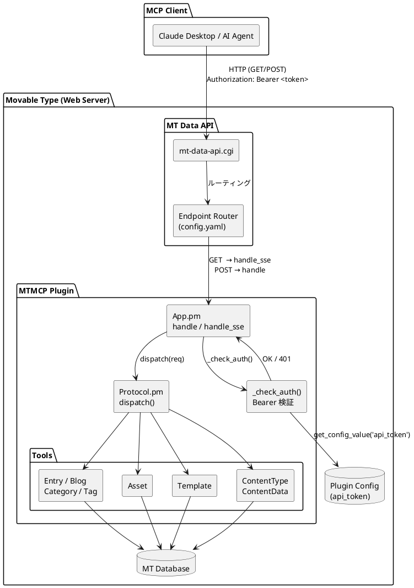
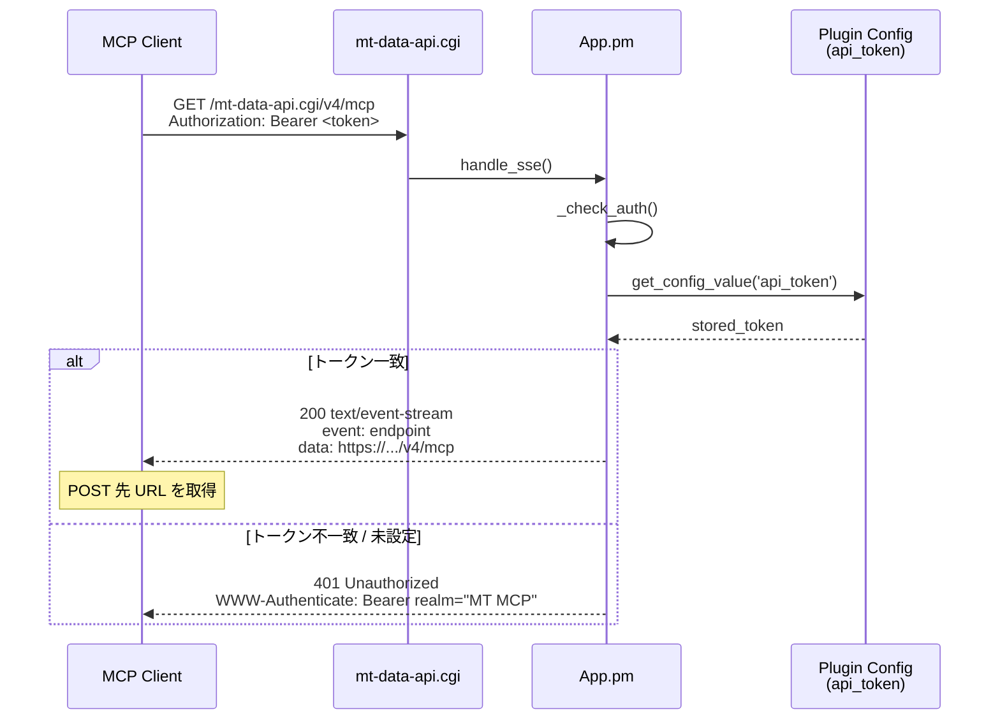
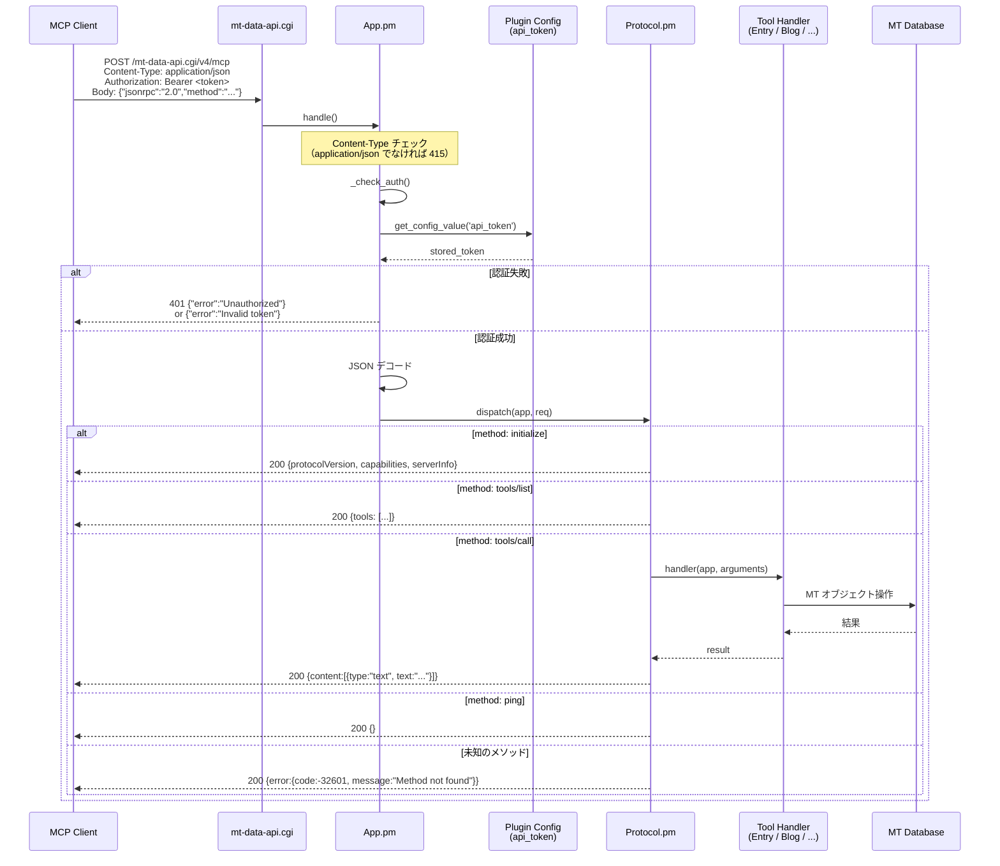
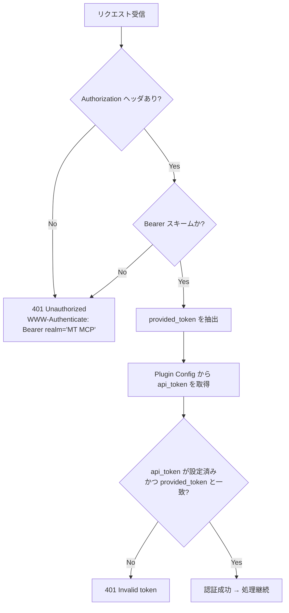

# MT MCP Server — 認証・接続アーキテクチャ

## 概要

MCP クライアント（Claude Desktop など）が Movable Type に接続する際の認証・通信フローを示す。

認証方式は **Bearer トークン（静的）** のみ。トークンはプラグイン設定画面（システム管理 > プラグイン > MT MCP Server）で発行し、`Authorization: Bearer <token>` ヘッダとして毎リクエストに付与する。

---

## コンポーネント図

---

## SSE 接続フロー（初回接続）

MCP クライアントは最初に GET で SSE エンドポイントへ接続し、POST 先 URL を受け取る。

---

## JSON-RPC リクエストフロー（MCP プロトコル）

SSE で取得した URL に対して MCP の JSON-RPC 2.0 メッセージを POST する。

---

## 認証チェック詳細（`_check_auth`）

> **注意**: トークンは固定文字列の完全一致比較のみ。有効期限・スコープ・複数トークンの概念はない。

---

## エンドポイント定義

`config.yaml` で登録される 2 つのエンドポイント：

| verb | route | handler | 用途 |
|------|-------|---------|------|
| GET  | `/v4/mcp` | `App::handle_sse` | SSE 接続・POST URL 通知 |
| POST | `/v4/mcp` | `App::handle` | JSON-RPC 2.0 メッセージ処理 |

いずれも `requires_login: 0`（MT セッション認証は不要）。Bearer トークン認証のみで制御する。
