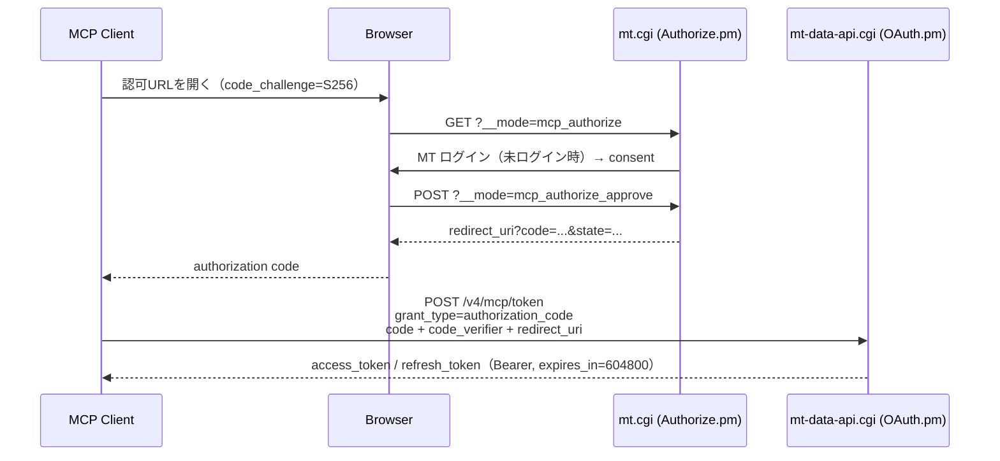
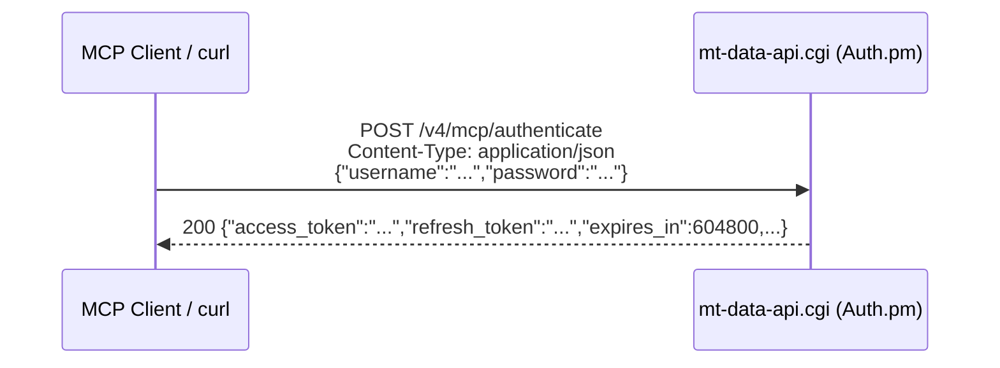
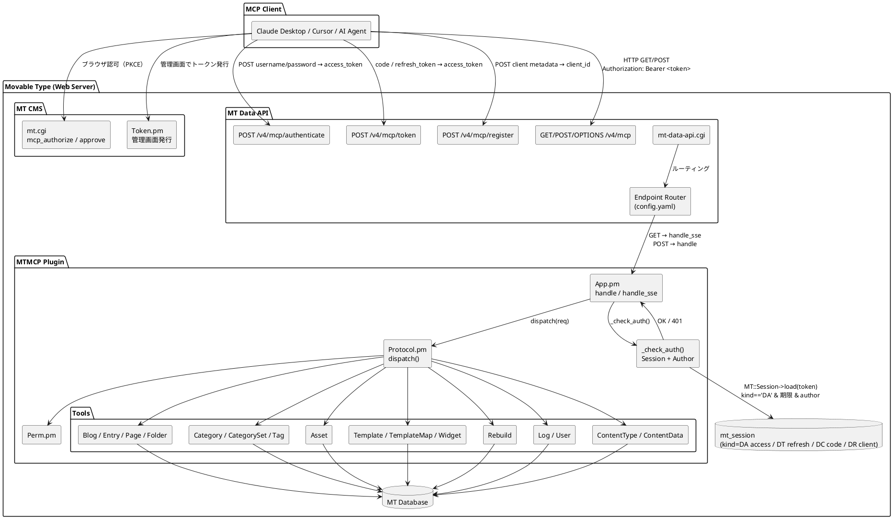
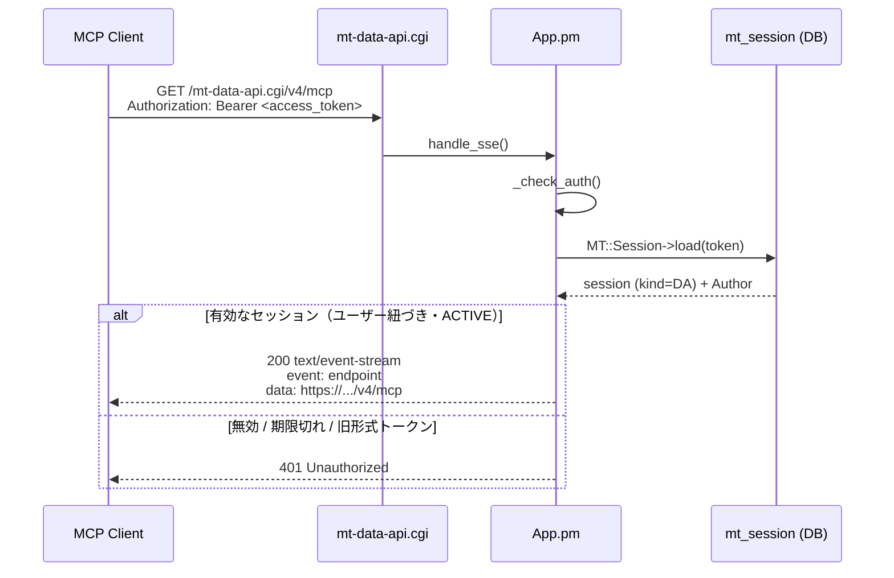
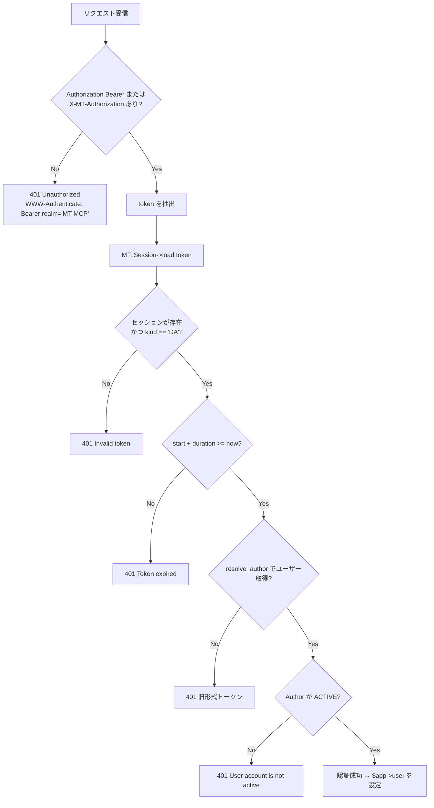

# MT MCP Server — 認証・接続アーキテクチャ

## 概要

MCP クライアント（Claude Desktop / Cursor など）が Movable Type に接続する際の認証・通信フロー。

認証の実体は **MT の Data API セッショントークン**（`MT::Session` kind=`DA`）です。トークンは必ず発行したユーザーに紐づき、以後の MCP 操作はそのユーザーの権限で実行されます。ユーザーが紐づかない旧形式のトークンは 401 で拒否します。

トークンの発行経路は次の3つです（いずれも同じセッション形式）。

| 経路 | エンドポイント | 用途 |
|------|----------------|------|
| OAuth 2.1 + PKCE（推奨） | `GET mt.cgi?__mode=mcp_authorize` → `POST /v4/mcp/token` | ブラウザで MT にログイン。パスワードを MCP クライアントに渡さない |
| ログイン API | `POST /v4/mcp/authenticate` | CLI / CI。JSON で username/password |
| 管理画面 | CMS `gen_mcp_token` | プラグイン設定画面から発行 |

MT 標準の `/v4/authentication` は使いません。プラグインが `/v4/mcp/*` を追加しています。

---

## トークン取得フロー

### OAuth 2.1 / PKCE（推奨）



`POST /v4/mcp/register`（RFC 7591 Dynamic Client Registration）で `client_id` を事前取得できます。client_secret は発行しません（PKCE のパブリッククライアント）。登録済みクライアントでは、認可時の `redirect_uri` が登録内容と完全一致することを要求します。

アクセストークンの有効期限は 7 日、リフレッシュトークンは 30 日です。`grant_type=refresh_token` のたびに両方をローテーションし、古い refresh_token は無効化します。

### ログイン API



5 回連続失敗で 15 分間ロックアウト（429）。成功時も `refresh_token` が付きます。以降の更新は OAuth と同じ `POST /v4/mcp/token` です。

---

## コンポーネント図



ツールの一覧と権限の詳細は [tools.md](tools.md) を参照してください。

---

## SSE 接続フロー



未認証時の `WWW-Authenticate` には `resource_metadata`（`.well-known/oauth-protected-resource`）を付け、OAuth 対応クライアントが認可サーバーを発見できるようにしています。`.well-known` 自体は MT の外側に静的配置します。

---

## 認証チェック詳細（`_check_auth`）



ツール実行時はさらに `MTMCP::Perm` でブログアクセス・個別アクション（`rebuild` / `edit_templates` など）や、ログ閲覧・ユーザー管理のシステム権限を確認します。

---

<a id="ヘッダーと-apache-の関係"></a>

## ヘッダーと Web サーバーの関係

`App.pm` は `Authorization: Bearer` を優先し、無ければ `X-MT-Authorization` にフォールバックする。Web サーバーがリクエストヘッダーを CGI / PSGI まで届けるかどうかは、手前の構成による。

| 構成 | `Authorization` の扱い | 必要な設定 | 備考 |
|------|------------------------|------------|------|
| Apache CGI | 既定で剥がす | `CGIPassAuth On` または RewriteRule | getting-started の推奨ルート |
| Nginx + fcgiwrap（CGI） | 既定では剥がさないが、`fastcgi_params` の書き方で欠ける | `fastcgi_param HTTP_AUTHORIZATION $http_authorization;` を明示 | `.cgi$` だけでは PATH_INFO 付き URI が 404 |
| Nginx → Starman / PSGI | 独自の `proxy_set_header` で他ヘッダーだけ上書きすると欠ける | `proxy_set_header Authorization $http_authorization;` を明示 | Starman 直結（前段 Nginx なし）では剥がさない |
| Nginx → Apache | Nginx が転送しても Apache 側でまた剥がされる | 両方必要（転送 + `CGIPassAuth`） | フロントだけ Nginx の構成 |
| カスタムヘッダー | 剥がさない（ハイフン付きなので `underscores_in_headers` 不要） | 不要 | `X-MT-Authorization: MTAuth accessToken=<token>`。サーバ設定を触れない場合のフォールバック |

Apache CGI での対応は次の3つ：

| 方法 | サーバ設定 | ヘッダー形式 | 備考 |
|------|-----------|-------------|------|
| `CGIPassAuth On` | VirtualHost 設定（要権限） | `Authorization: Bearer <token>` | **推奨** |
| RewriteRule | `.htaccess`（権限低め） | `Authorization: Bearer <token>` | **推奨** |
| カスタムヘッダー | 不要 | `X-MT-Authorization: MTAuth accessToken=<token>` | フォールバック |

Nginx 向けのサンプル（未検証の草案）は [README の Nginx の場合](../README.md#nginx-の場合) です。

### `Authorization: Bearer` を使う（推奨）

発行したトークンを MCP クライアントの `headers` に指定する。Apache では `Authorization` ヘッダーを CGI に渡す設定が必要。Nginx では FastCGI / リバースプロキシ側で明示する（上表）。OAuth 自動検出に対応したクライアントでは `headers` なしでも接続できる。

### カスタムヘッダーを使う（サーバ設定不要のフォールバック）

Apache はカスタムヘッダー（`X-*`）を剥がさず CGI の `HTTP_X_MT_AUTHORIZATION` 環境変数として渡す。Nginx でもハイフン付きのため `underscores_in_headers` は不要。サーバ設定を変更できない場合のフォールバックとして利用可能。

```
X-MT-Authorization: MTAuth accessToken=<accessToken>
```

### `.htaccess` で Bearer を通す

```apache
RewriteEngine On
RewriteRule .* - [E=HTTP_AUTHORIZATION:%{HTTP:Authorization}]
```

`App.pm` は `$ENV{REDIRECT_HTTP_AUTHORIZATION}` にフォールバックするため動作する。

---

## エンドポイント定義

`plugins/MTMCP/config.yaml` より。CMS 側は `mt.cgi` の `__mode`、Data API 側は `mt-data-api.cgi/v4` 配下です。

| verb | route | handler | 用途 |
|------|-------|---------|------|
| GET  | `mt.cgi?__mode=mcp_authorize` | `CMS::Authorize::show` | OAuth 認可（ログイン + consent） |
| POST | `mt.cgi?__mode=mcp_authorize_approve` | `CMS::Authorize::approve` | 許可/拒否 → `redirect_uri` |
| POST | `/v4/mcp/authenticate` | `Auth::handle_login` | ユーザー名/パスワード → トークン |
| POST | `/v4/mcp/token` | `OAuth::handle_token` | 認可コード+PKCE / refresh_token |
| POST | `/v4/mcp/register` | `OAuth::handle_register` | Dynamic Client Registration |
| GET  | `/v4/mcp` | `App::handle_sse` | SSE 接続・POST URL 通知 |
| POST | `/v4/mcp` | `App::handle` | JSON-RPC 2.0 メッセージ処理 |
| OPTIONS | `/v4/mcp` | `App::handle_options` | CORS プリフライト |
