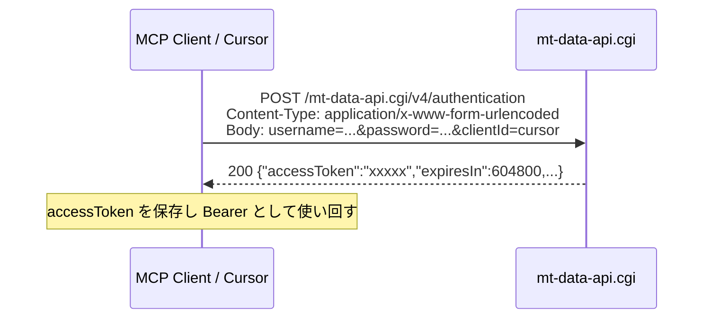
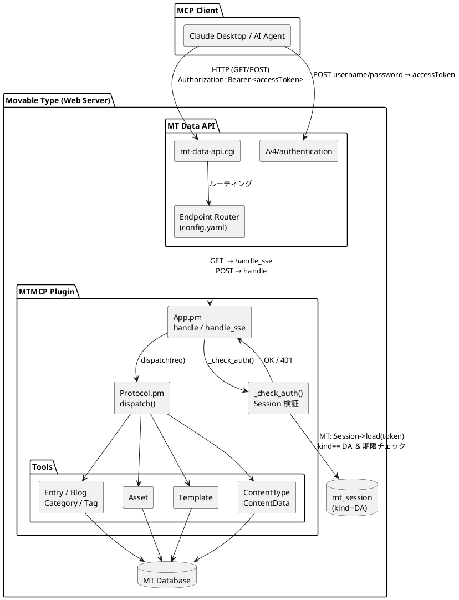
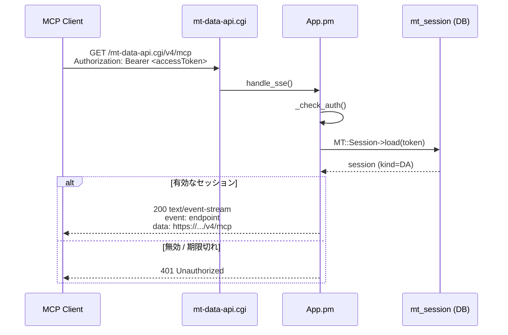

# MT MCP Server — 認証・接続アーキテクチャ

## 概要

MCP クライアント（Claude Desktop / Cursor など）が Movable Type に接続する際の認証・通信フロー。

認証方式は **MT Data API セッショントークン**。MT 管理画面と同じアカウントで `/v4/authentication` にログインして取得した `accessToken` を `Authorization: Bearer <accessToken>` として渡す。静的トークンの管理は不要。

---

## トークン取得フロー（初回のみ）



`expiresIn` は秒単位（デフォルト 7 日）。期限切れ後は再度 `/v4/authentication` で取得する。

---

## コンポーネント図



---

## SSE 接続フロー



---

## 認証チェック詳細（`_check_auth`）

```mermaid
flowchart TD
    A[リクエスト受信] --> B{Authorization ヘッダあり?}
    B -- No --> E1[401 Unauthorized\nWWW-Authenticate: Bearer realm='MT MCP']
    B -- Yes --> C{Bearer スキームか?}
    C -- No --> E1
    C -- Yes --> D[token を抽出]
    D --> F[MT::Session->load&#40;token&#41;]
    F --> G{セッションが存在\nかつ kind == 'DA'?}
    G -- No --> E2[401 Invalid token]
    G -- Yes --> H{start + duration >= now?}
    H -- No --> E3[401 Token expired]
    H -- Yes --> OK[認証成功 → 処理継続]
```



---

## ヘッダーと Apache の関係

Apache は `Authorization` ヘッダを CGI に渡す前に剥がす。対応方法は3つ：

| 方法 | サーバ設定 | ヘッダー形式 | 備考 |
|------|-----------|-------------|------|
| `CGIPassAuth On` | VirtualHost 設定（要権限） | `Authorization: Bearer <token>` | **推奨** |
| RewriteRule | `.htaccess`（権限低め） | `Authorization: Bearer <token>` | **推奨** |
| カスタムヘッダー | 不要 | `X-MT-Authorization: MTAuth accessToken=<token>` | フォールバック |

### `Authorization: Bearer` を使う（推奨）

設定画面で発行したトークンを MCP クライアントの `headers` に指定する。Apache が `Authorization` ヘッダーを CGI に渡すよう設定が必要。

### カスタムヘッダーを使う（Apache 設定不要のフォールバック）

Apache はカスタムヘッダー（`X-*`）を剥がさず CGI の `HTTP_X_MT_AUTHORIZATION` 環境変数として渡す。サーバ設定を変更できない場合のフォールバックとして利用可能。

```
X-MT-Authorization: MTAuth accessToken=<accessToken>
```

### `.htaccess` で Bearer を通す

```apache
RewriteEngine On
RewriteRule .* - [E=HTTP_AUTHORIZATION:%{HTTP:Authorization}]
```

`App.pm` は `$ENV{REDIRECT_HTTP_AUTHORIZATION}` にフォールバックするため動作する。

---

## エンドポイント定義

| verb | route | handler | 用途 |
|------|-------|---------|------|
| GET  | `/v4/mcp` | `App::handle_sse` | SSE 接続・POST URL 通知 |
| POST | `/v4/mcp` | `App::handle` | JSON-RPC 2.0 メッセージ処理 |
| OPTIONS | `/v4/mcp` | `App::handle_options` | CORS プリフライト |
